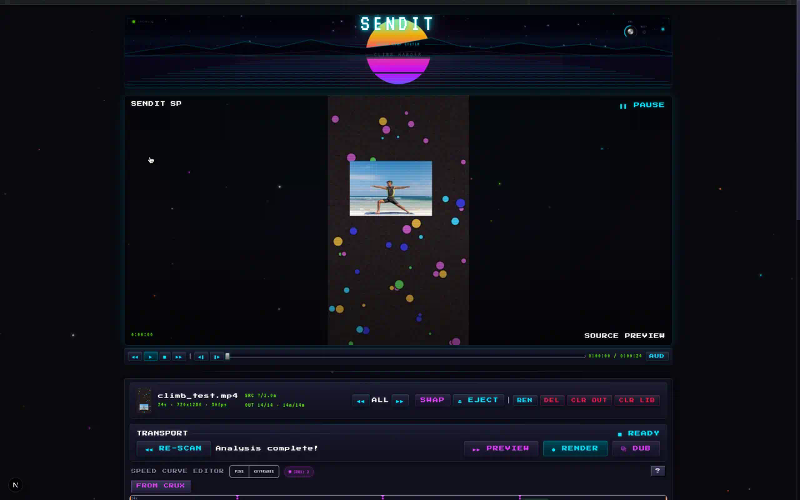
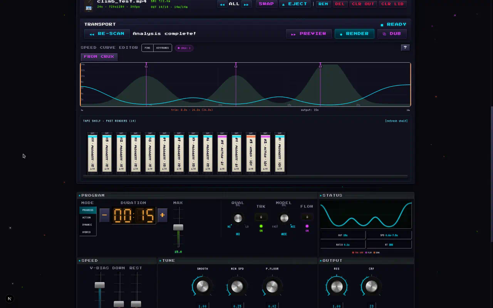
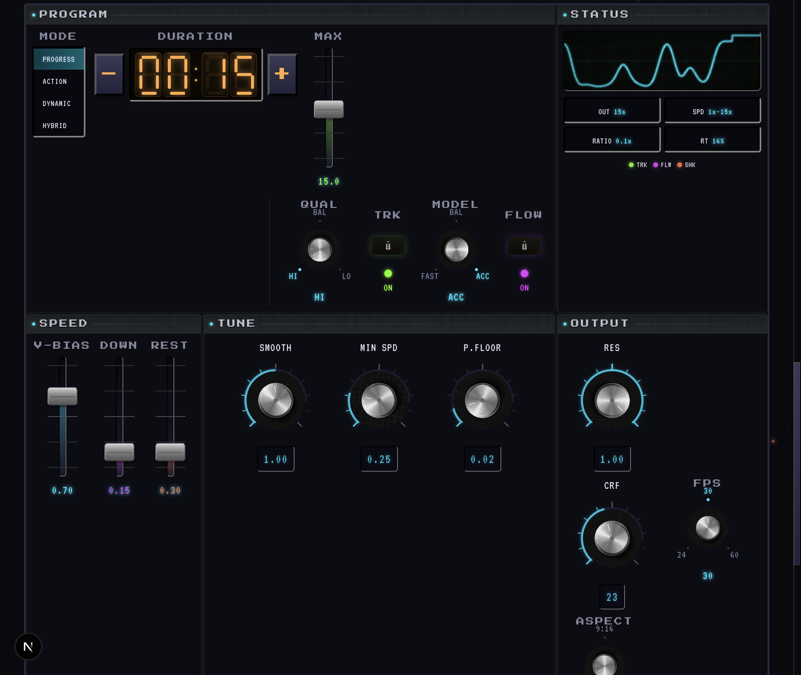

# SENDIT
meoq
**Auto speed-ramp your climbing sends.** Drop in a video, and SENDIT slows down the moves and fast-forwards the rest -- so 50% through the video means 50% up the boulder.

<!-- TODO: replace with a before/after GIF or MP4 of a raw send → speed-ramped output -->
<!--  -->

> **Weekend vibe-code project.** MediaPipe pose detection + FFmpeg rendering + a retro VCR interface I couldn't stop adding to. Built for my outdoor climbing videos but works on any climbing footage.



---

## The UI

The whole thing is styled like a piece of vintage rack-mount video gear -- CRT scanlines, VHS tracking noise, rotary knobs, fader sliders, tape counters, pilot lights. Every panel is a "module" in a dashboard grid with signal-flow lines connecting them.





---

## How it works

```
 ┌──────────┐     ┌──────────┐     ┌──────────┐     ┌──────────┐
 │  UPLOAD  │────▶│ ANALYZE  │────▶│  TWEAK   │────▶│  RENDER  │
 │          │     │          │     │          │     │          │
 │ drop a   │     │ MediaPipe│     │ timeline │     │ FFmpeg   │
 │ .mp4     │     │ pose     │     │ editor + │     │ + audio  │
 │          │     │ detection│     │ presets   │     │ stretch  │
 └──────────┘     └──────────┘     └──────────┘     └──────────┘
```

1. **Upload** a climbing video (`.mp4`, `.mov`, `.avi`, `.mkv`)
2. **Analyze** -- MediaPipe detects the climber's pose every frame, scores movement vs rest, tracks vertical progress up the wall
3. **Tweak** the speed curve in the interactive timeline editor, drag pins, or pick a preset
4. **Render** -- FFmpeg outputs the speed-ramped video with stabilization, audio time-stretch, and chapter overlays

## Speed-ramp modes

| Mode | What it does |
|------|-------------|
| **Constant Progress** | Output time = wall progress. At 50% of the video you're 50% up the boulder. Rest is auto-detected and fast-forwarded. |
| **Action Highlight** | Velocity-based scoring with per-limb weights. Big dynos get slow-mo, chalk-ups get skipped. Classic climbing edit. |
| **Dynamic** | Slows when center of mass moves fast -- catches dynos and big moves automatically. |
| **Hybrid** | Blends progress + action curves with a dedicated blend control. |

## Examples

Check out [`examples/`](examples/) for sample before/after renders from outdoor climbing sessions.

<!-- Add your climbing videos here! Each subfolder in examples/ has the raw clip,
     rendered output, and a speed curve screenshot. See examples/README.md for details. -->

| Clip | Style | Raw | Ramped | Ratio |
|------|-------|-----|--------|-------|
| *your-v4-sit-start* | Constant Progress | 2:30 | 0:38 | 6.5x |
| *your-roof-problem* | Action Highlight | 1:45 | 0:28 | 3.8x |
| *your-highball-slab* | Hybrid | 3:10 | 0:52 | 3.7x |

> Placeholder rows -- swap these with your actual sends once you render them.

---

## Quickstart

```bash
# backend
pip install -e .

# frontend
cd app && npm install
```

Requires **Python 3.9+**, **Node.js 18+**, and [FFmpeg](https://ffmpeg.org/) on your `PATH`.

Optional person tracking (YOLO + ByteTrack) for multi-person scenes:
```bash
pip install -e ".[tracking]"
```

## Usage

```bash
# terminal 1: API server
python server.py

# terminal 2: frontend
cd app && npm run dev
```

Open [localhost:3000](http://localhost:3000), drop in a video, hit **▶ ANALYZE**, tweak the curve, and **● RENDER**.

## Keyboard shortcuts

| Shortcut | Action |
|----------|--------|
| `Ctrl/Cmd + Shift + A` | Analyze / cancel |
| `Ctrl/Cmd + Enter` | Quick preview render |
| `Ctrl/Cmd + Shift + Enter` | Full render |
| `Esc` | Cancel active render |
| `J` / `K` / `L` | Seek back / play-pause / seek forward |
| `,` / `.` | Frame step |

Full shortcut reference in [docs/FEATURES.md](docs/FEATURES.md).

## Stack

| | |
|-|-|
| **Frontend** | Next.js 16, React 19, Tailwind 4, Zustand |
| **Backend** | FastAPI, Python |
| **Vision** | MediaPipe, OpenCV, optional YOLOv8 + ByteTrack |
| **Render** | FFmpeg, audio time-stretch, stabilization |
| **Vibes** | Press Start 2P + VT323 fonts, CRT scanlines, VHS tracking, neon everything |

## Architecture

```
server.py              FastAPI (upload → analyze → solve → render)
pipeline/
  pose.py              MediaPipe pose detection + sanitization
  movement.py          Movement & progress scoring
  speed_curve.py       Speed curve solvers (action/progress/hybrid)
  render.py            FFmpeg decode/encode + audio time-stretch
  stabilize.py         Pose-anchored + feature-based stabilization
  flow.py              Optical flow / camera motion estimation
  tracker.py           YOLOv8 + ByteTrack person tracking (optional)
app/                   Next.js frontend
  components/          Timeline editor, settings, video player, VCR controls
  lib/                 API client, Zustand store, types
```

## License

[MIT](LICENSE)
